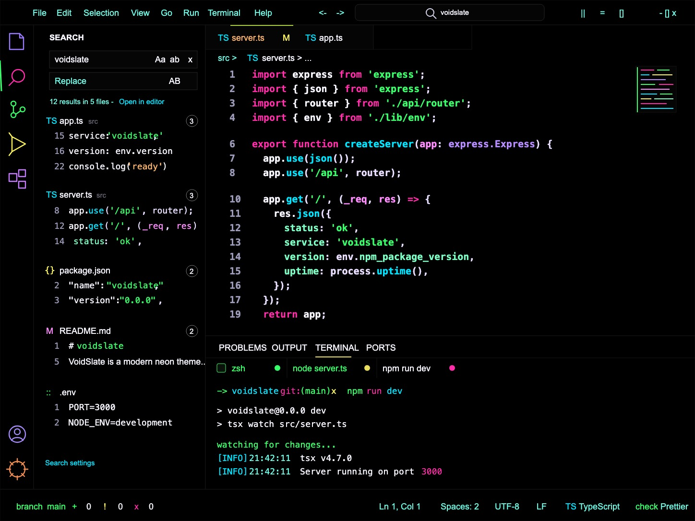

# VoidSlate

Super-flat black Visual Studio Code theme with much brighter neon syntax, compact workbench surfaces, and a bundled VoidSlate file icon theme.



## Author

- MrakBook - Boris Karaoglanov
- https://mrakbook.com
- boris@mrakbook.com

Theme URL: https://mrakbook.com/voidslate

## Included

- `VoidSlate` color theme with the black workbench, one-pixel dividers, very bright Activity Bar nav fallback colors, neon active lines, terminal ANSI colors, diagnostics, TextMate rules, and semantic token colors from the design guide.
- `VoidSlate Icons` file icon theme with 283 SVG icon definitions for common languages, configs, tools, package managers, media, documents, archives, databases, and project folders.
- `activitybar/voidslate-activitybar-colors.css`, a superflat per-section patch for very bright left Activity Bar icons and matching sidebar accents.
- `samples/voidslate-syntax.ts`, the TypeScript validation sample.
- `voidslate-recommended-settings.json` and `.vscode/settings.json` for the exact screenshot density: custom title bar, Fira Code stack, 14 px editor text, 22 px line height, 2-space tabs, and matching icon theme.
- `screenshots/voidslate-syntax-screen.jpeg`, `screenshots/voidslate-syntax-screen.svg`, and `screenshots/voidslate-icons-preview.svg` for visual QA.
- Package configuration defaults that select `VoidSlate`, `voidslate-icons`, and the guide's typography/density settings when no user override exists.

## Local Install

1. Copy this folder to your VS Code extensions directory as `voidslate-0.0.1`.
2. Reload VS Code.
3. Select **Preferences: Color Theme -> VoidSlate**.
4. Select **Preferences: File Icon Theme -> VoidSlate Icons**.

For a packed extension, run `vsce package` or `npx @vscode/vsce package` in this folder if you have VSCE available.

## Colored Activity Bar Icons

The normal installable theme colors the left Activity Bar nav icons with VoidSlate's bright purple fallback. VS Code themes only expose one shared Activity Bar icon color, so different per-section nav colors require applying the bundled workbench CSS patch.

After installing VoidSlate, run **VoidSlate: Apply Activity Bar Colors** from the Command Palette, then choose **Reload VS Code**. VoidSlate also prompts once on startup because VS Code requires patching its workbench CSS for separate Activity Bar colors. The patch makes the nav superflat and very bright: purple Explorer, magenta Search, green Source Control, yellow Run/Debug, violet Extensions, orange Testing, lavender Remote Explorer, lavender Account, and orange Settings. The active section color also carries into sidebar titles, focused inputs, list rows, and badges.

You can remove the patch with **VoidSlate: Remove Activity Bar Colors**. If VS Code updates itself, run **VoidSlate: Apply Activity Bar Colors** again.

For people who prefer a custom CSS loader extension, the same CSS is available directly:

```json
{
  "vscode_custom_css.imports": [
    "file:///Users/boris/lab/voidslate/activitybar/voidslate-activitybar-colors.css"
  ]
}
```

The helper file is saved at [activitybar/voidslate-custom-css-settings.json](/Users/boris/lab/voidslate/activitybar/voidslate-custom-css-settings.json).

## Exact-Match Notes

The color theme follows the design guide structure directly with the updated VoidSlate accent: dominant `#000000` surfaces, `#141414`/`#242424` borders, `#A8CF38` active tab line, `#E9DE5E` panel underline, very bright Activity Bar fallback icons, electric magenta keywords, electric green strings, bright cyan functions, violet types, hot purple parameters, mint properties, and acid yellow constants.

The base extension keeps the standard installable VS Code model: workbench colors plus the bundled multicolor file icon theme. The optional Activity Bar CSS patch adds superflat per-section left nav colors and uses the active nav color as the local accent for sidebar surfaces.

## Validation

```sh
npm run validate
```

The validator checks JSON validity, theme contribution paths, required guide colors, semantic/token-color coverage, screenshot/sample presence, author metadata, and every icon mapping/path.

## PLSR

VoidSlate includes a small `./plsr` helper inspired by the VibeguardBot platform scripts:

```sh
./plsr versions current
./plsr versions bump patch
./plsr doctor
./plsr actions-check
./plsr ci check
./plsr ci release-gate
./plsr package
```

It handles the real VS Code theme extension workflow: semver checks, `package.json` and `template/package.json` sync, theme/icon/runtime manifest checks, local validation, VSIX content verification, and packaging through `vsce` or `npx @vscode/vsce`.

GitHub Actions CI runs the same checks on pull requests and pushes, then uploads a verified VSIX artifact. Release automation runs from `vX.Y.Z` tags or manual dispatch, creates or updates the GitHub Release, and publishes to the Visual Studio Marketplace when `VSCE_PAT` is configured.
